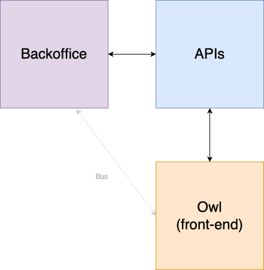
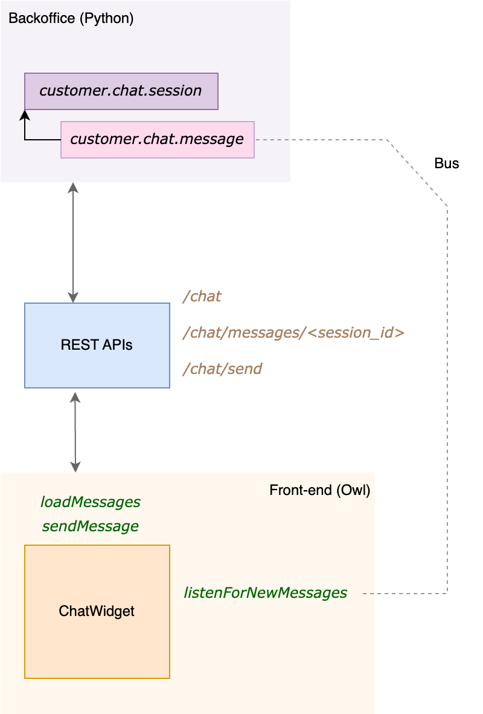
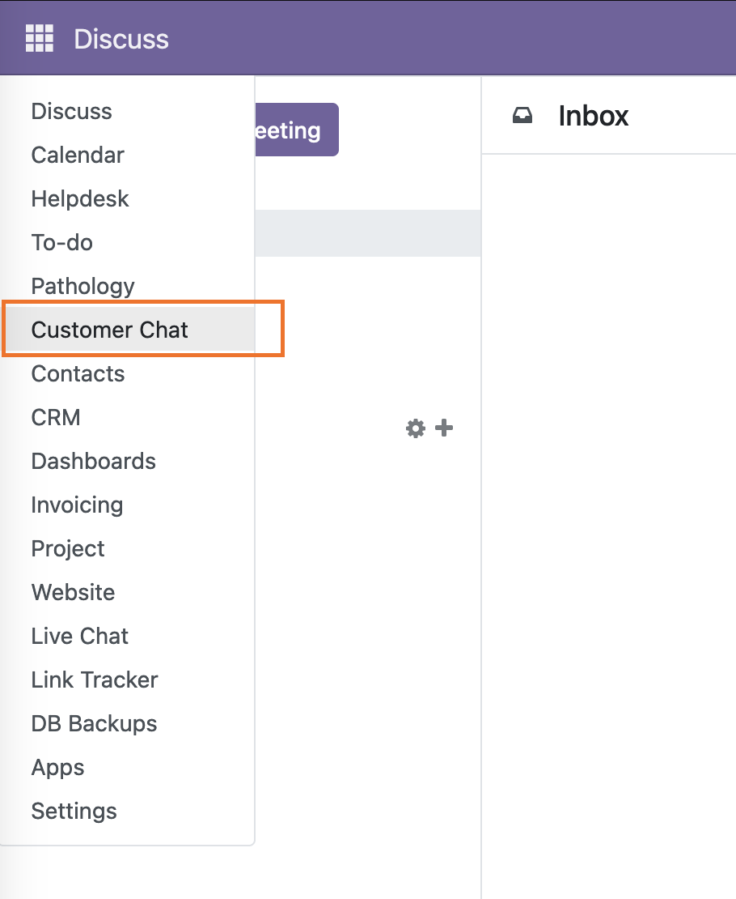
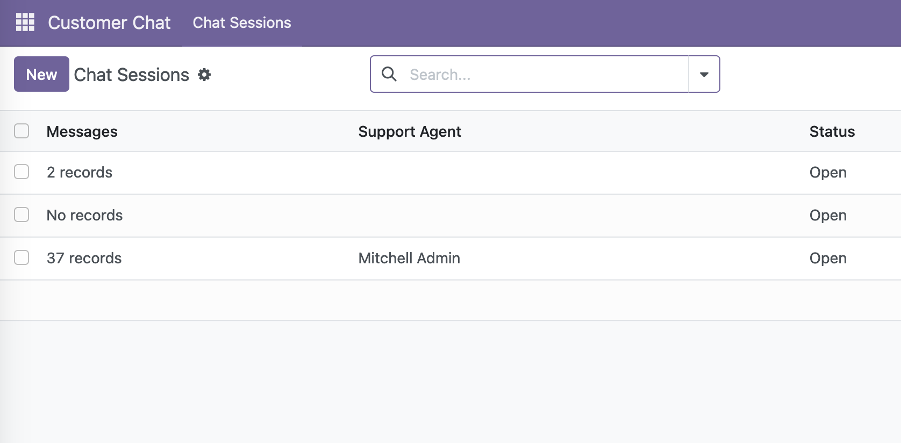
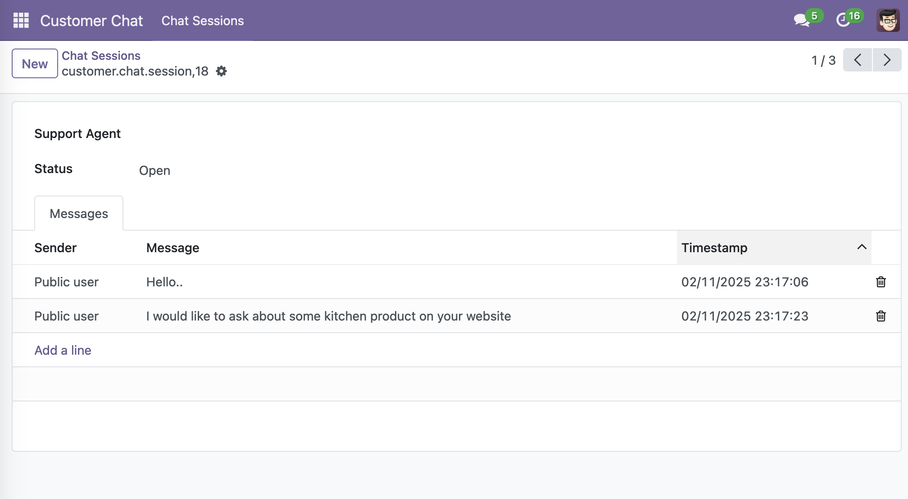
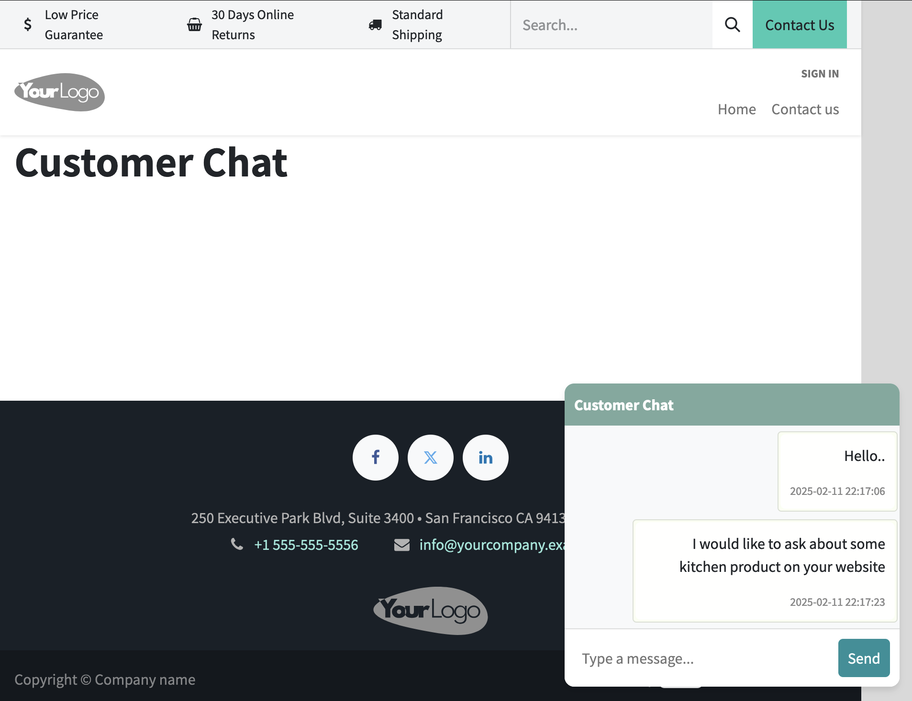
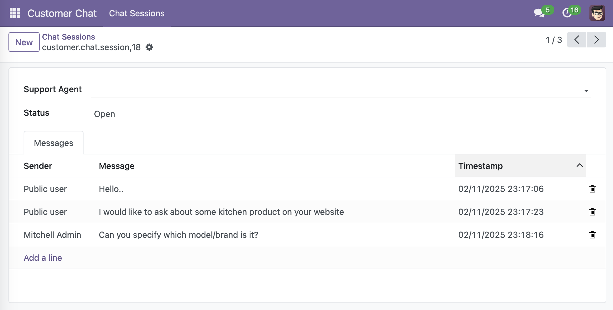
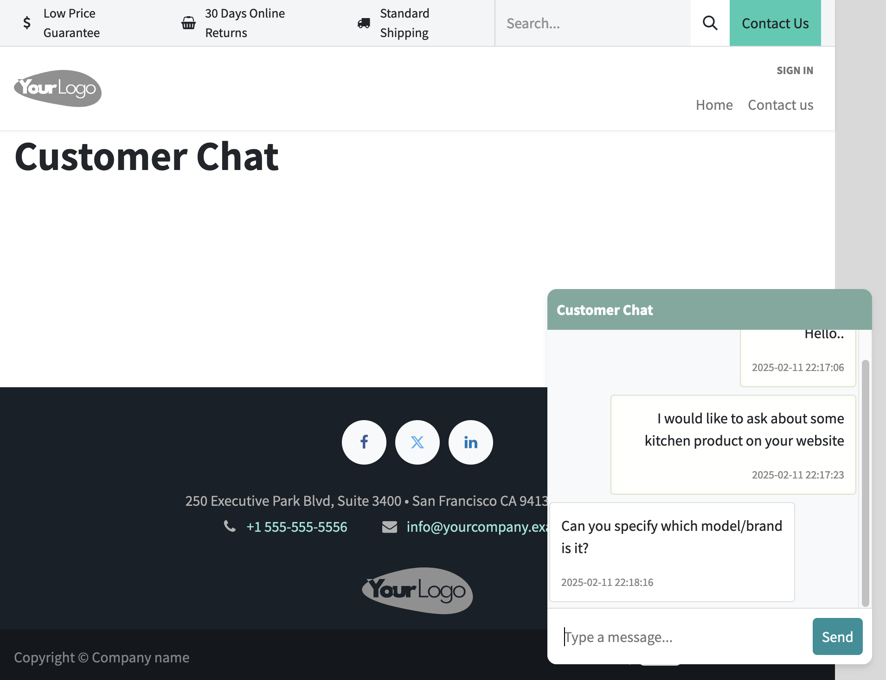

# Basic Customer Chat for Odoo

This module allows you to have a functional and basic conversation with visitors to your website.
It shows a chat widget by navigating to `/chat` where they can interact.

## Introduction

> How would the quick win solution look like and how would the state-of-the-art
solution look like?

This module represents the quick win solution, where it includes a chat window on the main website where and visitors or customers can send messages.
Messages are stored in the Odoo backoffice, and customer agents can reply the visitor inquires.

State-of-the-art solution would be integrated with existing Odoo CRM to link visitor interactions with their records.
Messages are automatically categorized and reported to the responsible customer agent.
Multi-channel support that integrates the chat with other communication channels like WhatsApp or an email.

## Technical Information

> I'll use the term _Backoffice_ to represent Odoo internal usage (e.g. server-side components and administrative interface), and Back-end as a REST-API.

The chat functionality requires the visitors (front-end) to interact with customer service agents (backend),
and so a required communication between the front-end and the back-end is required.

There are many ways to achieve cross-communication, and one way is by using the `bus` service.
The general overview of how they're connected is shown below:

Owl is communicating with the back-end by means of APIs, and the APIs communicate with the backoffice.
But, the Bus is also used to communicate directly with Owl to notify when the _agent_ replies to the customer.

A detailed overview is shown below:

### Backoffice 

Here, and in order to keep the solution simple, I've only used two classes to represent a session (`customer.chat.session`),
and a message (`customer.chat.message`). Each session model will include the visitor messages and the client session id, so 
that even when the visitor/user refreshes the page, the messages will be saved and loaded.
Once navigating to `/chat`, a new `customer.chat.session` is created if the browser session is new.
When the `agent_id` replies to the visitor, a new `customer.chat.message` is added and sent back to the visitor by means of a `bus`.

### Front-end

Owl is used here to interact with the REST-APIs and to represent the `ChatWidget`, where a chat widget is built and shown 
in the bottom right corner of the website.
Once the `ChatWidget` is _mounted_, it will load the visitor messages based on the `session_id`, that is passed from the REST-API when
`/chat` is called.
Messages are loaded now, and once a new message is typed by the visitor, it will be sent to `/chat/send` API to create a new message
for the visitor. If the customer agent sees the messages and replies, then `listenForNewMessages` is triggered, and the customer agent
message is shown to the visitor.

Here, the basic Customer Chat functionality is completed: The visitor sends a message, the customer agent sees the message, replies, and the visitor sees the reply.

## User Documentation

How to use this module is shown in the following screenshots. After installing `customer_chat` module:

1) The visitor goes to `<website>/chat` for chat support

2) Navigate to the Customer Chat menu

3) The customer agent sees visitor sessions

4) Now, when the agent clicks on a session, the visitor messages will be shown

5) At the same time, the visitor is querying and asking for help

6) The customer agent sees the messages and replies

7) Now, the visitor sees the reply instantly

## Suggested Enhancements

Currently, we live in the ChatGPT/LLMs era, which not only serve customer inquires, but also shaping how we interact with our devices and even the Web in general.
My opinion regarding enhancements to chat software solutions or any other software solution in general, is to respond _fast_ and _accurate_.
Being _fast_ is a broad criteria to achieve, but that is always a competitive advantage for companies that to work for.

The basic functionality of this Chat can be enhanced for a better user experience, both for the visitor and the customer agent.
Sure, Odoo Live Chat is way advanced than this, and it almost fulfills most users demands. But, from my side, and in addition to 
the Odoo Live Chat functionality, I would include AI models to help the visitors about that they need, and automate replies to a 
certain degree (some cases require customer agent intervention).
The other enhancement I would like to include is integrating it with a helpdesk system or with a CRM (as mentioned above).

